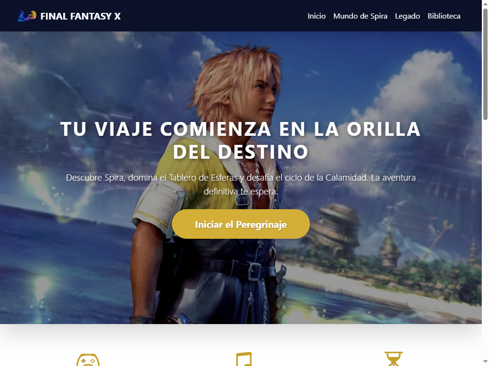
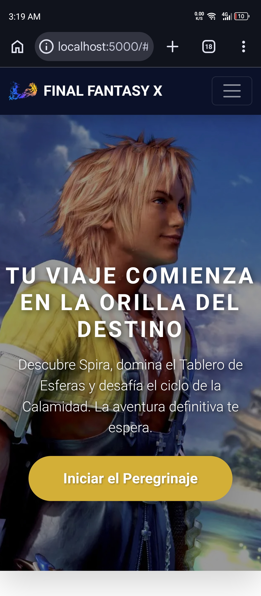

# Spira Corp | Final Fantasy X Corporate Edition 🎮💼


### 📸 Vista Previa
**Versión de Escritorio**


**Versión Móvil**


### *Donde la fantasía se encuentra con la excelencia corporativa.*

**Spira Corp** es un proyecto de portafolio que redefine el concepto de "Plantilla Corporativa Premium". Utilizando el universo de *Final Fantasy X* como hilo conductor, este desarrollo demuestra cómo una temática creativa puede transformarse en una solución empresarial elegante, funcional y de alto impacto visual.

---

## 🚀 Concepto del Proyecto
El objetivo principal fue desarrollar una estructura web profesional capaz de adaptarse a cualquier identidad de marca. En lugar de usar datos ficticios genéricos, se aplicó un "Mapeo Corporativo" sobre la narrativa de Spira, convirtiendo elementos de un RPG clásico en secciones de negocio de nivel corporativo.

### Estructura de Navegación:
- **Hero Section (Inicio):** Carrusel dinámico con `carousel-fade`, capas de **Glassmorphism** y optimización de legibilidad.
- **Mundo de Spira (Nosotros):** Equivalente a la sección institucional, con un tono solemne y roles profesionales definidos.
- **Legado (Trayectoria):** Un Roadmap empresarial que detalla la visión y valores a través de la historia.
- **Biblioteca (Recursos):** Repositorio de conocimiento tipo Blog/Whitepapers.

---

## 🛠️ Stack Tecnológico
Para garantizar un rendimiento óptimo y una arquitectura limpia, se utilizaron las siguientes herramientas:

- **Backend:** [Python](https://www.python.org/) + [Flask](https://flask.palletsprojects.com/) (Gestión de rutas y motor de plantillas Jinja2).
- **Frontend:** HTML5, CSS3 personalizado y [Bootstrap 5](https://getbootstrap.com/) (Sistema de Grid y componentes).
- **Almacenamiento de Datos:** [Supabase](https://supabase.com/) (PostgreSQL) para la gestión eficiente de activos y recursos multimedia en la nube.
- **Tipografía y UI:** Google Fonts & Bootstrap Icons.

---

## 🎨 Sistema de Skinning (Temas)
La web incluye una arquitectura de estilos que permite cambiar la identidad visual de forma manual y sencilla. Se incluyen tres variantes en `/static/css/`:
1. **Dorado Solemne (Default):** Inspirado en las ruinas de Zanarkand; el look más lujoso.
2. **Azul Clásico:** La interfaz icónica de FFX adaptada a la web moderna.
3. **Zanarkand Night:** Un enfoque tecnológico en tonos gris acero y neón.

---

## 💎 Detalles Técnicos de Valor
- **Mobile First & Responsive:** Optimización garantizada para dispositivos móviles (Vertical/Horizontal).
- **Navbar Fixed:** Navegación persistente sin saltos visuales mediante ajuste de píxeles preciso.
- **Optimización Multimedia:** Uso avanzado de `object-fit: cover` y filtros dinámicos para asegurar el contraste de texto sobre imágenes de alta resolución.
- **Arquitectura de Plantillas:** Uso de herencia de archivos (`base.html`) para un mantenimiento de código escalable y eficiente.

---

## 🔧 Instalación y Uso Local

1. Clona el repositorio:
   ```bash
   git clone [https://github.com/Reimel-Maestre/FFX-web-project.git](https://github.com/Reimel-Maestre/FFX-web-project.git)
